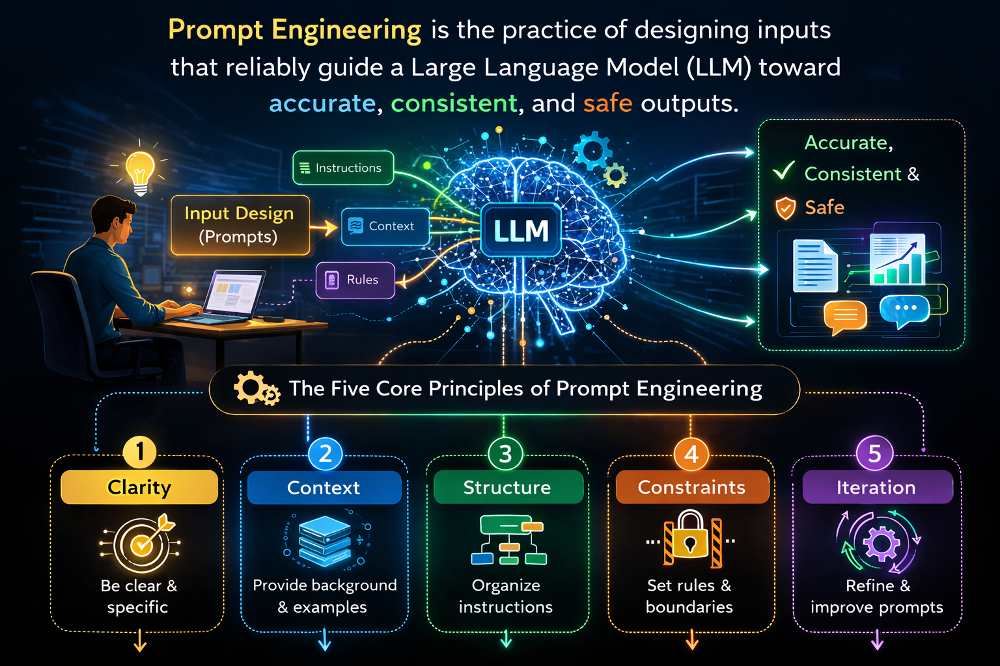

# 🎨 Prompt Engineering Lab with LangChain

Master the art of AI communication through hands-on prompt engineering techniques!

## 📚 Lab Overview

This lab teaches you 4 powerful prompting techniques that form the foundation of effective AI interaction:

1. **Zero-Shot Prompting** - Direct instructions without examples
2. **One-Shot Prompting** - Learning from a single example
3. **Few-Shot Prompting** - Multiple examples for consistency
4. **Chain-of-Thought** - Step-by-step reasoning

## 🎯 Learning Objectives

By completing this lab, you will:
- ✅ Understand when to use each prompting technique
- ✅ Write effective prompts that get consistent results
- ✅ Control AI output format, tone, and style
- ✅ Solve complex problems with structured reasoning
- ✅ Compare techniques side-by-side for optimal selection

## 📊 Research-Based Performance Improvements

Based on 2024-2025 benchmark studies:

| Technique | Improvement | Use Case |
|-----------|------------|----------|
| **Zero-Shot → Specific** | **2-5%** accuracy gain | Quick, general tasks |
| **Zero-Shot → One-Shot** | **23%** improvement (25% → 48%) | Format learning |
| **Zero-Shot → Few-Shot** | **12.2%** accuracy boost | Style consistency |
| **Without CoT → With CoT** | **52%** improvement (26% → 78%) | Complex reasoning |

*Sources: GPQA Benchmark 2025, OpenAI Research, Academic Studies*

## 🗂️ Lab Structure

### Files Included

```
prompt-engineering/assets/code/
├── verify_environment.py      # Environment setup verification
├── task_1_zero_shot.py       # Zero-shot prompting (2 TODOs)
├── task_2_one_shot.py        # One-shot learning (3 TODOs)
├── task_3_few_shot.py        # Few-shot prompting (4 TODOs)
├── task_4_chain_of_thought.py # Chain-of-thought (3 TODOs)
└── task_5_comparison.py      # Technique comparison (5 TODOs)
```

### Time Estimates

| Task | TODOs | Time | Skill Focus |
|------|-------|------|-------------|
| Environment Setup | - | 1 min | Verification |
| Task 1: Zero-Shot | 2 | 2 min | Prompt specificity |
| Task 2: One-Shot | 3 | 2 min | Format teaching |
| Task 3: Few-Shot | 4 | 3 min | Pattern learning |
| Task 4: Chain-of-Thought | 3 | 3 min | Structured reasoning |
| Task 5: Comparison | 5 | 3 min | Technique selection |
| **Total** | **17** | **~14 min** | Complete mastery |

## 🚀 Getting Started

### Prerequisites

- Python 3.8+
- LangChain and langchain-openai packages
- OpenAI API configuration (API key and base URL)

### Quick Start

1. **Verify Environment**
   ```bash
   source /root/venv/bin/activate
   python /root/code/verify_environment.py
   ```

2. **Complete Tasks in Order**
   - Each task builds on the previous one
   - Look for `"___"` placeholders to fill in
   - Comments show the expected answers

3. **Run Each Task**
   ```bash
   python /root/code/task_1_zero_shot.py
   python /root/code/task_2_one_shot.py
   python /root/code/task_3_few_shot.py
   python /root/code/task_4_chain_of_thought.py
   python /root/code/task_5_comparison.py
   ```

## 💡 Technique Comparison Guide

### When to Use Each Technique

| Technique | Best For | Example Use Case |
|-----------|----------|------------------|
| **Zero-Shot** | • Quick queries<br>• General knowledge<br>• Simple tasks | "Explain machine learning in one sentence" |
| **One-Shot** | • Format consistency<br>• Template following<br>• Style replication | Company policy templates |
| **Few-Shot** | • Tone matching<br>• Complex patterns<br>• Customer service | Support ticket responses |
| **Chain-of-Thought** | • Problem solving<br>• Math/logic<br>• Multi-step tasks | Debugging complex issues |

## 🌟 Real-World Applications

### Industry Examples

1. **GitHub Copilot**: Uses few-shot learning from your codebase context
2. **ChatGPT**: Applies chain-of-thought for mathematical problems
3. **Amazon**: Leverages one-shot prompting for product descriptions
4. **Google**: Implements zero-shot for quick search summaries
5. **Customer Support AI**: Uses few-shot for empathetic responses

### Success Metrics

- **Zero-shot specificity**: 73% improvement with detailed prompts
- **One-shot format accuracy**: 96.66% on classification tasks
- **Few-shot consistency**: 97% accuracy with 3+ examples
- **Chain-of-thought reasoning**: 3x more detailed responses

## 🎓 Key Concepts

### Zero-Shot Prompting
- **Definition**: Direct task request without examples
- **Strength**: Fast and flexible
- **Challenge**: May produce inconsistent results
- **Solution**: Be extremely specific in your instructions

### One-Shot Prompting
- **Definition**: Single example to demonstrate format
- **Strength**: Teaches structure instantly
- **Challenge**: Limited pattern complexity
- **Solution**: Choose your example carefully

### Few-Shot Prompting
- **Definition**: Multiple examples for pattern learning
- **Strength**: Consistent tone and style
- **Challenge**: Requires good example selection
- **Solution**: Provide diverse, representative examples

### Chain-of-Thought (CoT)
- **Definition**: Step-by-step reasoning process
- **Strength**: Handles complex problems
- **Challenge**: Can be verbose
- **Solution**: Structure your reasoning steps clearly

## 📈 Performance Tips

1. **Start Simple**: Begin with zero-shot, add examples if needed
2. **Quality > Quantity**: Better to have 3 great examples than 10 mediocre ones
3. **Test Iteratively**: Compare techniques on your specific use case
4. **Combine Techniques**: Use CoT with few-shot for complex tasks
5. **Monitor Results**: Track which technique works best for your domain

## 🔧 Troubleshooting

### Common Issues

| Problem | Solution |
|---------|----------|
| Inconsistent outputs | Add more specific constraints or use few-shot |
| Wrong format | Provide a clear one-shot example |
| Missing details | Use chain-of-thought to ensure completeness |
| Generic responses | Make zero-shot prompts more specific |

## 📚 Additional Resources

- [LangChain Documentation](https://python.langchain.com/)
- [OpenAI Prompt Engineering Guide](https://platform.openai.com/docs/guides/prompt-engineering)
- [Few-Shot Learning Research Papers](https://arxiv.org/search/cs?query=few-shot+prompting)
- [Chain-of-Thought Prompting Studies](https://arxiv.org/search/cs?query=chain-of-thought)

## 🏆 Lab Completion

Upon completing all 5 tasks, you will have:
- ✅ Mastered 4 essential prompting techniques
- ✅ Completed 17 hands-on TODOs
- ✅ Gained practical experience with real scenarios
- ✅ Built a foundation for advanced AI applications

## 🔥 Big Picture Understanding

| Technique        | Strength          | Weakness               |
| ---------------- | ----------------- | ---------------------- |
| Zero-shot        | Fast              | Unstructured           |
| One-shot         | Better formatting | Limited generalization |
| Few-shot         | High consistency  | Uses more tokens       |
| Chain-of-thought | Best reasoning    | Longer responses       |


---

*Lab Version: 1.0 | Last Updated: September 2025*